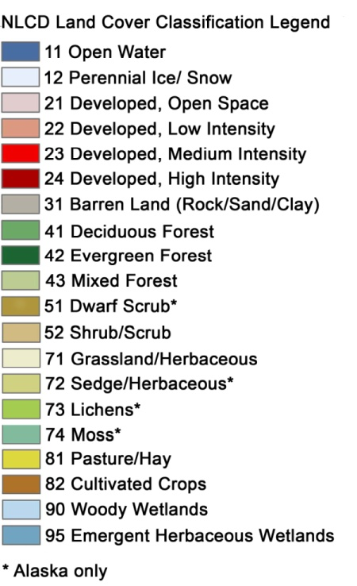

# National Land Cover Database

## Overview

The [National Land Cover Database](https://www.mrlc.gov/national-land-cover-database-nlcd-2016) (NLCD) provides US-wide data on land cover and land cover change at a 30m resolution with a 16-class legend.  This Azure dataset reflects the CONUS and Alaska portions of NLCD 2016, which includes land cover for years 2001, 2003, 2006, 2008, 2011, 2013, and 2016.  

Source: U.S. Geological Survey (USGS)

Domain: continental US and Alaska, 2001-2016

Resolution: 30m

This dataset was curated and brought to Azure by [CarbonPlan](https://carbonplan.org/).

## Storage resources

Data are stored in blobs in the West Europe Azure region, in the following blob folder:

`https://cpdataeuwest.blob.core.windows.net/cpdata/raw/nlcd`

Within that folder, data are organized according to:

`[region]/30m/[year].tif`

`region` is the spatial domain; currently `conus` or `ak`.

`year` is the four-digit year (e.g. 2014).

Images are stored in cloud-optimized GeoTIFF format.  The one and only image channel contains land cover labels according to the [NLCD legend](https://www.mrlc.gov/data/legends/national-land-cover-database-2016-nlcd2016-legend):

A complete Python example of accessing and plotting NLCD data is available in the notebook provided under &ldquo;data access&rdquo;.

We also provide a read-only SAS (<a href="https://docs.microsoft.com/en-us/azure/storage/common/storage-sas-overview">shared access signature</a>) token to allow access to this data via, e.g., BlobFuse, which allows you to mount blob containers as drives:

`?sv=2019-12-12&si=cpdata-ro&sr=c&sig=tqRGrmdYYa9WYkaPi0wWOD0nalRdNGTZNe97GL2enDA%3D`

Mounting instructions for Linux are [here](https://docs.microsoft.com/en-us/azure/storage/blobs/storage-how-to-mount-container-linux).

Large-scale processing is best performed in the West Europe Azure data center, where the data are stored.  If you are using this data for environmental science applications, consider applying for an [AI for Earth grant](http://aka.ms/ai4egrants) to support your compute requirements.

## Contact

For questions about this dataset, contact [`aiforearthdatasets@microsoft.com`](mailto:aiforearthdatasets@microsoft.com?subject=nlcd%20question).

## Pretty picture

US national land cover for 2001.

## Notices

MICROSOFT PROVIDES AZURE OPEN DATASETS ON AN "AS IS" BASIS. MICROSOFT MAKES NO WARRANTIES, EXPRESS OR IMPLIED, GUARANTEES OR CONDITIONS WITH RESPECT TO YOUR USE OF THE DATASETS. TO THE EXTENT PERMITTED UNDER YOUR LOCAL LAW, MICROSOFT DISCLAIMS ALL LIABILITY FOR ANY DAMAGES OR LOSSES, INCLUDING DIRECT, CONSEQUENTIAL, SPECIAL, INDIRECT, INCIDENTAL OR PUNITIVE, RESULTING FROM YOUR USE OF THE DATASETS. 

This dataset is provided under the original terms that Microsoft received source data. The dataset may include data sourced from Microsoft.
